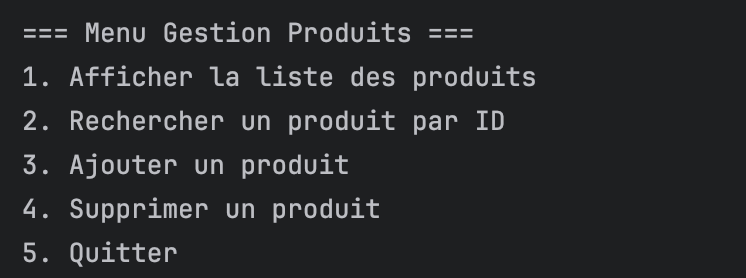
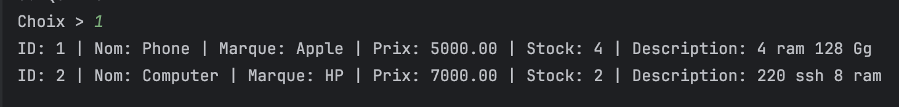
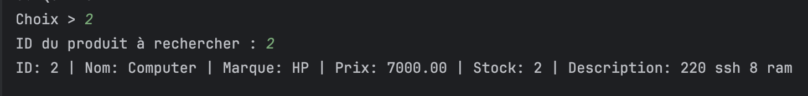
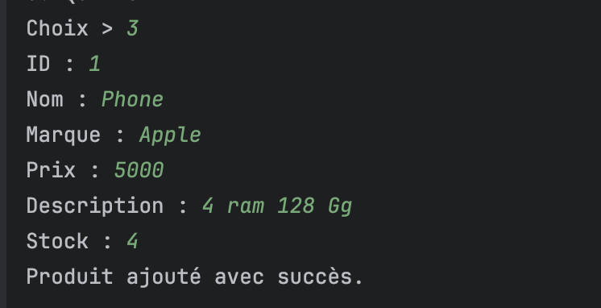
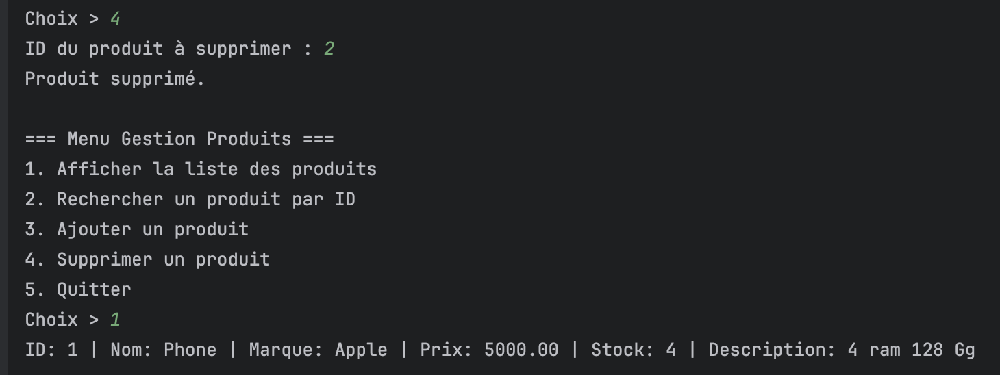

# 🛒 Gestion de Produits en Java avec Généricité

> Application console Java démontrant l'utilisation de **la généricité** et des **interfaces** pour gérer des entités `Produit`.  
> Conforme au TP "La généricité" (POO Java).

---

## ✨ Fonctionnalités

- 📋 **Afficher tous les produits**
- 🔍 **Rechercher un produit par ID**
- ➕ **Ajouter un produit**
- ❌ **Supprimer un produit**
- 🚪 **Quitter le programme**

---

## 📦 Structure du projet

/src
├── Produit.java # Classe représentant un produit
├── IMetier.java # Interface générique pour la gestion des entités
├── MetierProduitImpl.java # Implémentation de l'interface pour Produit
└── Application.java # Point d'entrée avec menu console

yaml
Copy
Edit

---

## 🛠 Prérequis

- **Java JDK 8+** installé (`java -version` et `javac -version` doivent fonctionner)
- Un **terminal / console** ou un IDE comme IntelliJ IDEA, Eclipse ou VS Code

---

## 🚀 Compilation et exécution

1. **Cloner** le projet ou copier les fichiers `.java` dans un dossier `src/`
   ```bash
   git clone https://github.com/youssef-baaziz/gestion-produits-generics.git
   cd gestion-produits-generics/src
Compiler :

    ```bash
    javac *.java
    ```
Exécuter :

    ```bash
    java Application
    ```
📸 Captures d’écran

1️⃣ Menu principal
(Affichage du menu après lancement du programme)



2️⃣ Affichage de tous les produits
(Liste tabulaire avec ID, Nom, Marque, Prix, Stock, Description)



3️⃣ Recherche par ID
(Exemple : recherche du produit ID = 101)



4️⃣ Ajout d’un produit
(Saisie des informations du produit)



5️⃣ Suppression d’un produit
(Suppression d’un produit via son ID)

